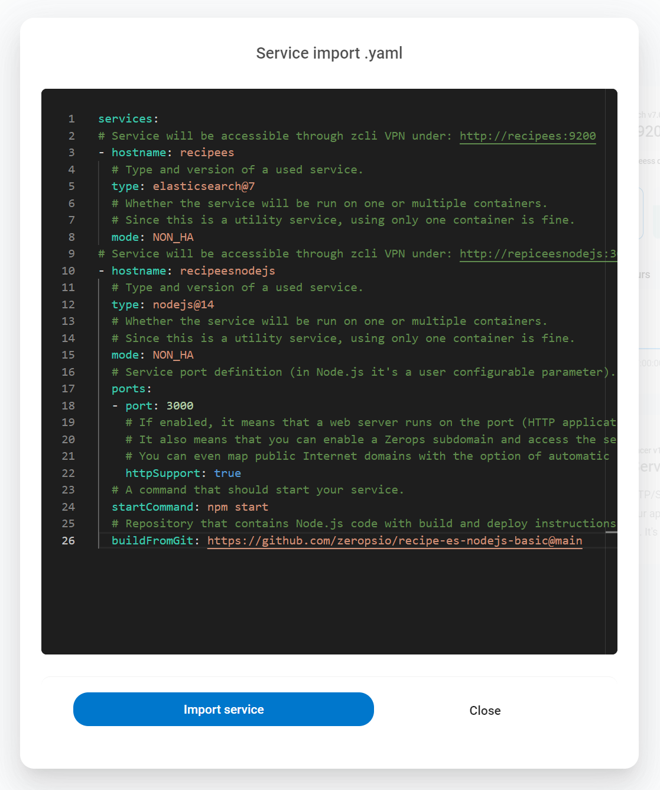
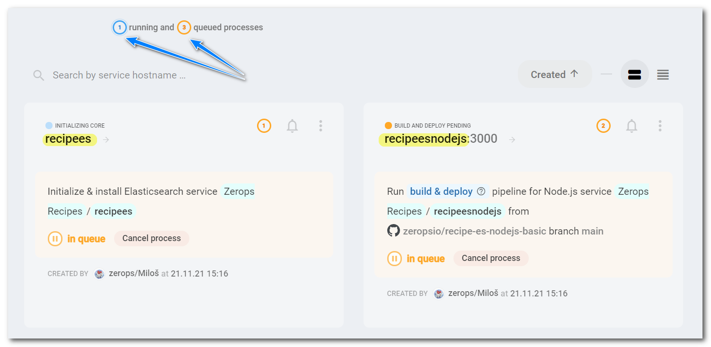
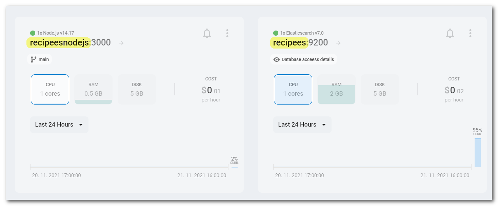
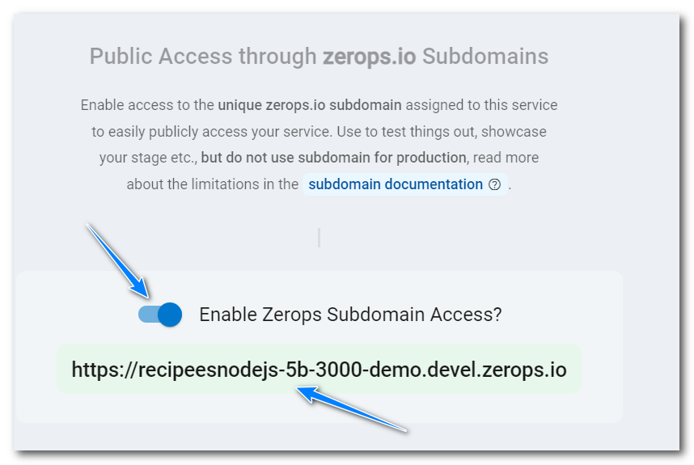
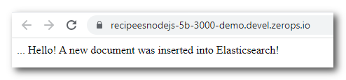

# ZEROPS RECIPES

The concept of pre-prepared skeletons demonstrates the way how to set up and use technologies Zerops is supporting.

## Recipe: Basic integration of Elasticsearch & Node.js

Pre-prepared skeleton demonstrating the way how to set up and use Node.js and [Elasticsearch](https://www.elastic.co/elasticsearch) in Zerops. The main focus is on the client [Node.js SDK](https://www.elastic.co/guide/en/elasticsearch/client/javascript-api/current/index.html) (here, **v7.15** is used) configuration to connect the Elasticsearch service and show a simple example of how to insert a new document.

## Zerops import syntax

```yaml
services:
# Service will be accessible through zcli VPN under: http://recipees:9200
- hostname: recipees
  # Type and version of a used service.
  type: elasticsearch@7
  # Whether the service will be run on one or multiple containers.
  # Since this is a utility service, using only one container is fine.
  mode: NON_HA
# Service will be accessible through zcli VPN under: http://repiceesnodejs:3000
- hostname: recipeesnodejs
  # Type and version of a used service.
  type: nodejs@14
  # Whether the service will be run on one or multiple containers.
  # Since this is a utility service, using only one container is fine.
  mode: NON_HA
  # Service port definition (in Node.js it's a user configurable parameter).
  ports:
  - port: 3000
    # If enabled, it means that a web server runs on the port (HTTP application protocol is supported).
    # It also means that you can enable a Zerops subdomain and access the service from the Internet.
    # You can even map public Internet domains with the option of automatic support for SSL certificates.
    httpSupport: true
  # A command that should start your service.
  startCommand: npm start
  # Repository that contains Node.js code with build and deploy instructions.
  buildFromGit: https://github.com/zeropsio/recipe-es-nodejs-basic@main
```

Copy & paste the import snippet above into the dialog of **Import service** functionality.



See the [Zerops documentation](https://docs.zerops.io/documentation/export-import/project-service-export-import.html) to understand how to use it.

## Using the recipe

1. Use the Zerops [importing](/documentation/export-import/project-service-export-import.html#how-to-export-import-a-project) functionality to import [both recipe services](#zerops-import-syntax) into your already existing Zerops project.

2. Wait till the moment when both services will be created and running.




3. Open the **recipeesnodejs** Node.js service to get access to its details.

4. Open the **Private & public access** section in detail and turn on the switch **Enable Zerops Subdomain Access**. Wait till the moment it's processed.



5. Click on the activated subdomain URL to open a new web page. You can see the result of a essential operation when a new document is inserted into the Elasticsearch service from the Node.js environment using the Elasticsearch SDK.



6. In the end, **don't forget to disable** the Zerops subdomain access. Finally, you can delete both services from your project to keep it clear and **save your free or paid Zerops credit** because you can always recreate it entirely from the beginning.

7. Instead of using a Zerops subdomain, you can [map your public domain](http://docs.zerops.io/documentation/routing/using-your-domain.html) to access the service.
